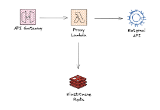

# DynamoDB Caching with Redis using AWS Lambda and API Gateway

This project demonstrates how to implement a cache-aside pattern using:
- AWS DynamoDB as the primary data store
- ElastiCache Redis as the cache layer
- AWS Lambda for the business logic
- API Gateway as the HTTP interface
- Terraform for infrastructure as code

## Architecture



## Features

- Cache-aside pattern implementation
- VPC-isolated Redis cluster
- Terraform modules for reusable infrastructure
- CI/CD pipeline with GitHub Actions
- CloudWatch monitoring integration

## Deployment

1. Clone the repository
2. Configure AWS credentials
3. Initialize Terraform:
   ```bash
   terraform init
   
### Deploy the infrastructure:
   ```bach
   terraform apply
   ```
### Testing
After deployment, you can test the API endpoint:
```bash
curl https://your-api-gateway-url/product/123
```
First call will be a cache miss, subsequent calls within the TTL window will be cache hits.

### Monitoring
CloudWatch metrics are available for:

Cache hits/misses

Lambda execution duration

Redis memory usage
